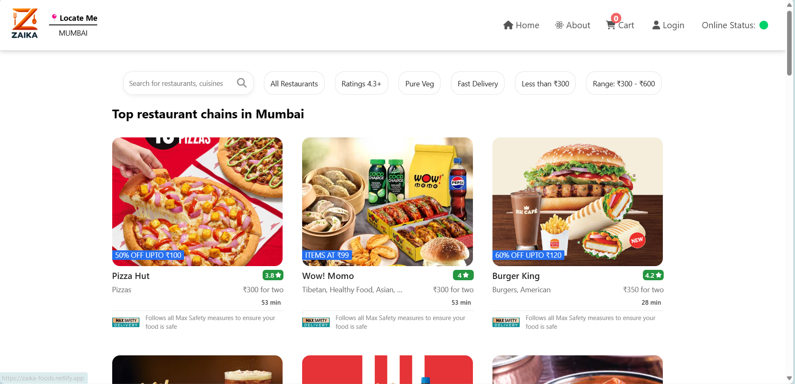

# Zaika - The Swaad of India 🍽️

     

Zaika is a modern food delivery platform that brings the authentic taste of India right to your doorstep. Built with React and powered by Firebase, it offers a seamless food ordering experience with real-time updates and secure authentication.



## ✨ Features

### Core Features
- 🔐 Secure Authentication with Email and Google Sign-in
- 🍽️ Real-time Restaurant Menu Updates
- 🛒 Smart Cart Management with Redux
- 📍 Location-based Restaurant Discovery
- 💳 Seamless Checkout Process
- 🎨 Responsive Design for All Devices

### Technical Highlights
- ⚡ Optimized Performance with React
- 🔥 Real-time Updates with Firebase
- 🔄 State Management with Redux
- 🎯 Custom Hooks for Business Logic
- 🌐 Location-based Services
- 🎨 Modern UI with CSS3 Animations
- 🔍 Smart Search and Filtering
- 📱 Progressive Web App (PWA) Support

## 🚀 Quick Start

### Prerequisites

- Node.js (version 16 or higher)
- npm or yarn package manager
- Firebase account and project setup
- Git for version control

### Installation

```bash
# Clone the repository
git clone https://github.com/imrajeevnayan/E-COMMERCE-WEB.git

# Navigate to the project directory
cd ziaka

# Install dependencies
npm install

# Set up environment variables
# Create a .env file in the root directory and add your Firebase config:
REACT_APP_FIREBASE_API_KEY=your_api_key
REACT_APP_FIREBASE_AUTH_DOMAIN=your_auth_domain
REACT_APP_FIREBASE_PROJECT_ID=your_project_id
REACT_APP_FIREBASE_STORAGE_BUCKET=your_storage_bucket
REACT_APP_FIREBASE_MESSAGING_SENDER_ID=your_sender_id
REACT_APP_FIREBASE_APP_ID=your_app_id

### Development

```bash
# Start the development server
npm start

# Run tests
npm test

# Build for production
npm run build

# Deploy to Firebase
npm run deploy
```

The development server will start at `http://localhost:1234`

### Environment Setup

1. Create a Firebase project at [Firebase Console](https://console.firebase.google.com/)
2. Enable Authentication (Email/Password and Google Sign-in)
3. Set up Firestore Database
4. Add your Firebase configuration to `.env` file
5. Enable required APIs in Google Cloud Console for location services


## 📜 Available Scripts

| Script | Description |
|--------|-------------|
| `npm start` | Starts the development server |
| `npm test` | Runs the test suite |
| `npm run build` | Builds the app for production |
| `npm run deploy` | Deploys the app to Firebase Hosting |
| `npm run lint` | Runs ESLint for code quality |
| `npm run format` | Formats code with Prettier |


## 📁 Project Structure

```
ziaka/
├── README.md
├── package.json
├── index.html
├── src/
│   ├── App.jsx                 # Main application component
│   ├── components/             # React components
│   │   ├── About.jsx          # About page
│   │   ├── Body.jsx           # Main content
│   │   ├── Cart.jsx           # Shopping cart
│   │   ├── Header.jsx         # Navigation header
│   │   ├── Login.jsx          # Authentication
│   │   ├── RestaurantMenu.jsx # Restaurant details
│   │   └── ...
│   └── utils/                 # Utility functions and configurations
│       ├── firebase.js        # Firebase configuration
│       ├── AuthContext.js     # Authentication context
│       ├── cartSlice.js       # Redux cart slice
│       └── ...
├── logos/                     # Image assets
└── public/                    # Static files
```

## 🛠️ Tech Stack

### Frontend
- **React** - UI Framework
- **Redux Toolkit** - State Management
- **React Router** - Navigation
- **CSS3** - Styling and Animations
- **Lottie React** - Animations

### Backend & Services
- **Firebase Authentication** - User Management
- **Firebase Firestore** - Data Storage
- **Firebase Hosting** - Deployment

### Tools & Utilities
- **Parcel** - Build Tool
- **Jest** - Testing Framework
- **ESLint** - Code Quality
- **Git** - Version Control

## 🌟 Key Features In Detail

### User Experience
- Seamless authentication with email/password and Google sign-in
- Real-time order tracking and updates
- Intelligent search with filters for cuisine, rating, and price range
- Smart cart management with persistent storage
- Location-based restaurant discovery
- Responsive design for all device sizes

### Restaurant Partners
- Detailed restaurant profiles
- Real-time menu management
- Order management system
- Analytics and insights
- Customer feedback system

## 🗺️ Roadmap

### Upcoming Features
- [ ] Online payment integration
- [ ] Restaurant partner dashboard
- [ ] Customer loyalty program
- [ ] Advanced order tracking
- [ ] AI-powered restaurant recommendations
- [ ] Multi-language support
- [ ] Dark mode support
- [ ] Performance optimizations

## 🤝 Contributing

We welcome contributions! Here's how you can help:

### Development Process

1. Fork the repository
2. Create your feature branch (`git checkout -b feature/amazing-feature`)
3. Make your changes
4. Add tests for your changes
5. Ensure all tests pass
6. Commit your changes (`git commit -m 'Add some amazing feature'`)
7. Push to the branch (`git push origin feature/amazing-feature`)
8. Open a Pull Request

## 📝 License

This project is licensed under the MIT License - see the [LICENSE](LICENSE) file for details.

## 👏 Acknowledgments

- Design inspiration from leading food delivery platforms
- Icons from Font Awesome
- Animations from Lottie
- All our contributors and supporters

### Code Style

- Follow the existing code style
- Run the linter before submitting: `npm run lint`
- Write meaningful commit messages
- Add tests for new features

### Reporting Issues

- Use the GitHub issue tracker
- Provide detailed information about the bug
- Include steps to reproduce the issue
- Add relevant labels


## 📄 License

This project is open source. Please check the repository for license information.

## 👥 Authors

- **imrajeevnayan** - *Project Creator* - [@imrajeevnayan](https://github.com/imrajeevnayan)

## 🙏 Acknowledgments

- Thanks to all contributors who have helped shape this project
- Inspired by the open-source community
- Built with ❤️ and modern development practices

## 📊 Project Stats

- ⭐ Stars: 0
- 🍴 Forks: 0
- 🐛 Issues: 0
- 📝 Language: JavaScript

---

⭐️ If you found this project helpful, please give it a star!


